\newpage

# 1. Introduction

## 1.1 Contexte et Objectif
Ce rapport synthétise la démarche et les résultats obtenus dans le cadre de "Introduction à l'IA" (2IA). L'objectif principal est de mettre en oeuvre et de comparer les performances de plusieurs algorithmes de recherche sur des problèmes types représentatifs.

Cette étude vise à évaluer les points forts, les limites et les comportements des méthodes de recherche (informées et non informées). L'analyse s'appuie essentiellement sur deux indicateurs clés : le temps de calcul nécessaire pour trouver une solution et l'espace mémoire utilisé. Nous observerons également l'impact de la taille des instances et des stratégies d'initialisation sur ces performances.

## 1.2 Problèmes traités
Conformément aux directives suggérant des problèmes de type "plus court chemin" ou des jeux combinatoires, nous avons choisi d'analyser les performances de nos algorithmes sur trois domaines distincts :

- **Recherche de chemin dans un graphe général :**
    Application des algorithmes de base pour explorer la connectivité et l'optimalité sur des graphes abstraits.
    - *Algorithmes testés :* BFS, DFS, Dijkstra.

- **Navigation sur grille avec obstacles :**
    Recherche de chemin dans un environnement 2D (grille) impliquant une topologie régulière mais contrainte par une densité variable d'obstacles.
    - *Algorithmes testés :* BFS, DFS, Dijkstra, A\*, IDA\*.

- **Les Tours de Hanoï[^1] :**
    Résolution d'un problème combinatoire classique, permettant d'évaluer la capacité des algorithmes à gérer un espace d'états croissant exponentiellement avec le nombre de disques (similaire à la complexité du Taquin).
    - *Algorithmes testés :* DFS, BFS, Dijkstra, A\*, IDA\*.
- **Le problème des missionnaires et des cannibales[^2] :**
    Modélisation d’un problème classique de planification et de recherche d’état, évaluant la capacité d’un algorithme à éviter les configurations interdites tout en explorant un espace d’états fortement contraint.
    - *Algorithmes testés :* DFS, BFS, Dijkstra, A\*, IDA\*.

[^1]: Voir la définition et les règles du problème sur [Wikipedia - Tours de Hanoï](https://fr.wikipedia.org/wiki/Tours_de_Hano%C3%AF).
[^2]: Voir la définition et les règles du problème sur [Wikipedia - Missionaries and cannibals problem](https://en.wikipedia.org/wiki/Missionaries_and_cannibals_problem).

# 2. Méthodologie

## 2.1 Environnement technique

Conformément aux modalités laissant le choix des technologies libre, nous avons développé nos solutions en utilisant l'environnement suivant :

- **Langage :** Python 3.12.3.

- **Système d'exploitation :** Ubuntu 24.04.3 LTS.
- **Matériel de test :** Les benchmarks ont été exécutés sur un ordinateur portable ASUS Vivobook (M3500QC) équipé de :
    - **Processeur :** AMD Ryzen™ 5 5600H 
    - **Mémoire (RAM) :** 16 Go.

- **Système d'exploitation :** Windows 11 24H2.
- **Matériel de test :** Les benchmarks ont été exécutés sur un ordinateur portable ASUS ROG Strix équipé de :
    - **Processeur :** AMD Ryzen™ 9  7845HX 
    - **Mémoire (RAM) :** 16 Go.

- **Code source :** [https://github.com/SebastianCaron/benchmark-strats](https://github.com/SebastianCaron/benchmark-strats)

\newpage

# 3. Résultats et Analyse

Cette section présente les résultats expérimentaux obtenus. Nous commençons par l'analyse des algorithmes sur des graphes abstraits générés aléatoirement.

## 3.1 Recherche de chemin dans un graphe général

Pour cette première série de tests, nous avons comparé **BFS**, **DFS** et **Dijkstra** sur des graphes orientés aléatoires. Les algorithmes ont été exécutés 100 fois pour chaque taille de graphe ($N \in \{10, 20, 40, 80, 160, 320\}$) afin de lisser les variations de temps d'exécution. Les poids des arêtes ont été fixés uniformément à $(1, 1)$ pour permettre une comparaison équitable entre les algorithmes pondérés et non pondérés.

### 3.1.1 Visualisation des performances

Les graphiques suivants illustrent l'évolution des métriques (Temps, Mémoire, Noeuds explorés) en fonction de la taille du graphe (nombre de noeuds).

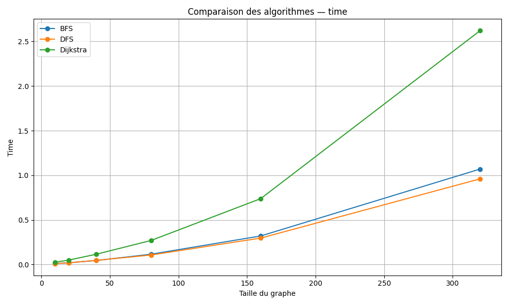{ width=80% }

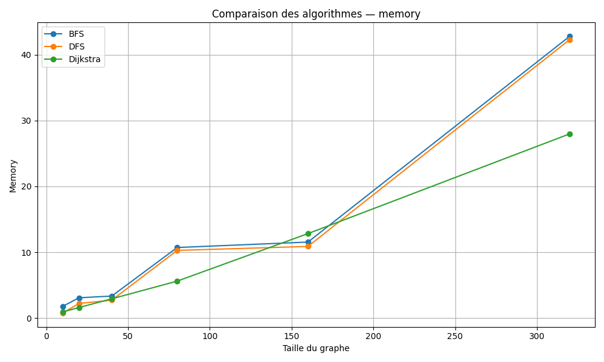{ width=80% }

{ width=80% }

### 3.1.2 Analyse détaillée par stratégie

#### Breadth-First Search (BFS - Parcours en Largeur)

Le parcours en largeur explore le graphe niveau par niveau.

- **Avantages :** Sur nos instances à poids uniformes, BFS garantit de trouver le chemin le plus court en termes de nombre d'arcs. Il est particulièrement efficace pour les graphes peu profonds.

- **Inconvénients :** Sa consommation mémoire est généralement élevée car il doit stocker tous les noeuds de la "frontière" actuelle (la file d'attente) en mémoire.

- **Performance observée :** BFS montre un temps d'exécution très compétitif (0.61s pour 320 noeuds), très proche de DFS.

#### Depth-First Search (DFS - Parcours en Profondeur)

Le parcours en profondeur explore une branche aussi loin que possible avant de revenir en arrière (backtracking).

- **Avantages :** Théoriquement, DFS est plus économe en mémoire (complexité spatiale proportionnelle à la profondeur). Il peut trouver une solution très rapidement s'il a de la "chance" sur le choix des voisins (cas favorable).

- **Inconvénients :** Il ne garantit pas l'optimalité du chemin trouvé (sauf exploration complète). Il peut s'enfermer dans des branches très profondes inutiles.

- **Performance observée :** DFS affiche des temps similaires à BFS sur nos tests (0.65s pour 320 noeuds).

#### Dijkstra

L'algorithme de Dijkstra explore le graphe en privilégiant toujours le noeud ayant le coût de chemin le plus faible depuis l'origine.

- **Avantages :** Il garantit le chemin le plus court absolu, quels que soient les poids des arêtes (tant qu'ils sont positifs). C'est l'algorithme de référence pour les graphes pondérés.

- **Inconvénients :** Il est structurellement plus lourd que BFS/DFS. La gestion de la file de priorité (Priority Queue) ajoute un surcoût algorithmique logarithmique à chaque insertion/extraction.

- **Performance observée :** Comme prévu, Dijkstra est l'algorithme le plus lent de notre comparatif (1.47s pour 320 noeuds, soit environ 2.3x plus lent que BFS). Ce surcoût est le prix à payer pour la garantie d'optimalité dans un contexte pondéré général.

### 3.1.3 Synthèse comparative

Le tableau ci-dessous résume les données moyennes extraites de nos expérimentations pour trois tailles représentatives.

| Taille (N) | Algorithme | Temps Moyen (s) | Mémoire Moyenne (Mo) | Noeuds Explorés (Moyenne) |
| :---: | :--- | :--- | :--- | :--- |
| **10** | BFS | 0.008 | 1.72 | 5.2 |
| | DFS | 0.007 | 0.71 | 4.9 |
| | Dijkstra | 0.020 | 0.93 | 5.5 |
| **80** | BFS | 0.060 | 10.83 | 41.3 |
| | DFS | 0.058 | 9.95 | 40.0 |
| | Dijkstra | 0.163 | 5.61 | 39.5 |
| **320** | BFS | 0.618 | 42.45 | 156.3 |
| | DFS | 0.656 | 42.37 | 166.6 |
| | Dijkstra | 1.474 | 27.96 | 158.1 |

**Conclusion sur les graphes :**
Sur des graphes non pondérés (ou à poids uniformes), **BFS** est le meilleur compromis, offrant la garantie d'optimalité avec un temps d'exécution minimal. **Dijkstra** ne se justifie que si des poids variables sont introduits. Une observation intéressante concerne la mémoire à grande échelle (N=320) où Dijkstra semble mieux optimisé dans notre implémentation (27.9 Mo) par rapport à BFS/DFS (~42 Mo).

## 3.2 Navigation sur grille avec obstacles

Dans cette seconde phase, nous évaluons les algorithmes dans un environnement structuré : une grille 2D de taille $N \times N$ où les déplacements sont limités aux 4 points cardinaux. Des obstacles (murs) ont été générés aléatoirement pour complexifier la topologie et forcer les algorithmes à contourner des zones.

**Configuration des tests :**

- **Tailles de grille ($N$) :** 40, 80, 160, 320.

- **Heuristique utilisée ($h(n)$) :** La **Distance de Manhattan**, calculée comme $|x_{start} - x_{goal}| + |y_{start} - y_{goal}|$.

### 3.2.1 Visualisation des performances sur grille

Les graphiques ci-dessous comparent les méthodes aveugles (BFS, DFS, Dijkstra) et les méthodes informées (A\*, IDA\*).

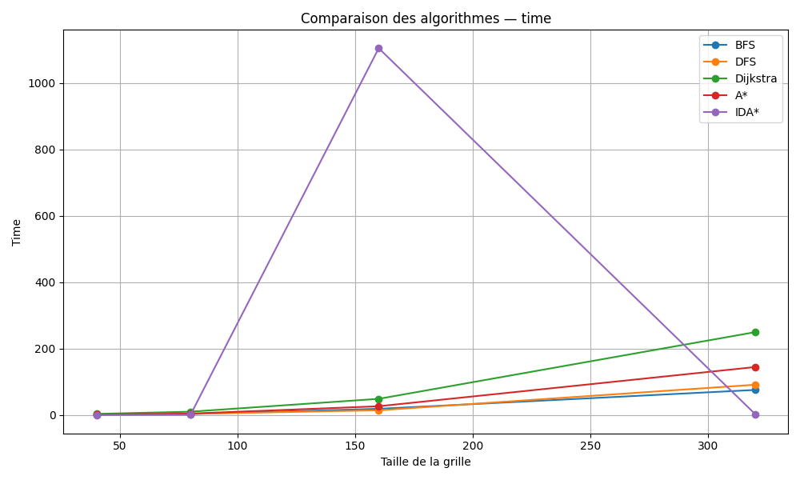{ width=80% }

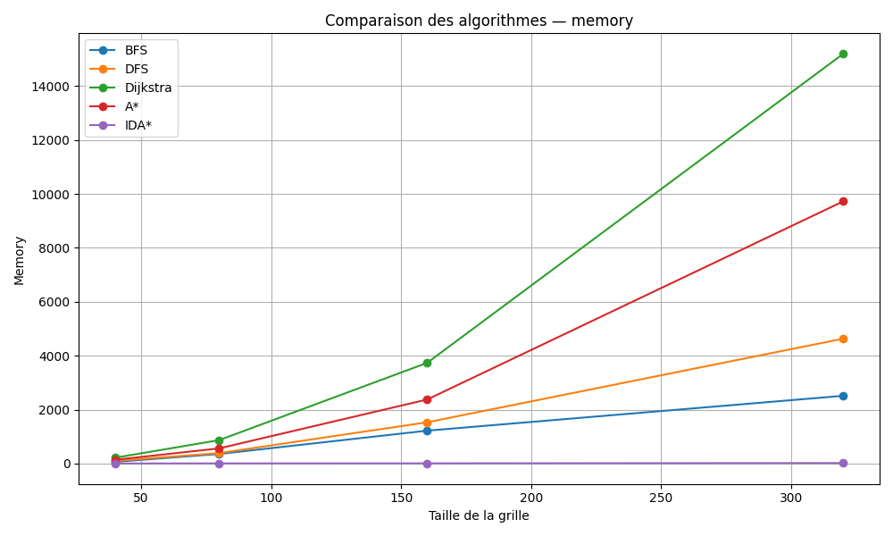{ width=80% }

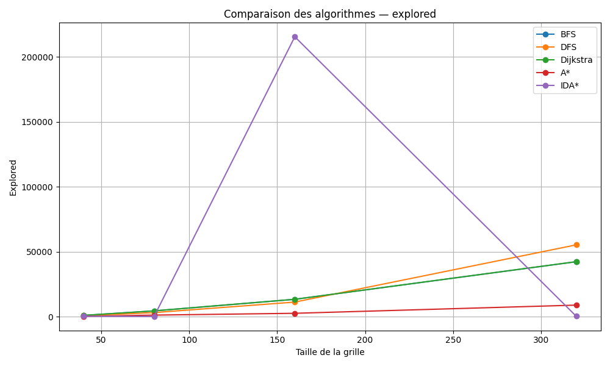{ width=80% }

### 3.2.2 Analyse des stratégies non informées

Avant d'aborder les heuristiques, il est crucial d'analyser le comportement des algorithmes classiques sur cette topologie de grille.

#### **BFS (Breadth-First Search)**

Sur une grille à poids uniformes, le BFS se comporte comme une onde qui se propage de manière circulaire autour du point de départ.

- **Performance :** Il reste l'algorithme non informé le plus rapide (76s pour $N=320$).

- **Mémoire :** La consommation reste modérée sur les tailles moyennes, mais atteint **3 Go** pour $N=320$. Cela s'explique par la taille de la "frontière" (le périmètre du cercle d'exploration) qui grandit linéairement avec le rayon de recherche.

#### **DFS (Depth-First Search)**

- **Comportement :** Contrairement au graphe aléatoire, le DFS sur grille souffre terriblement de l'absence de direction. Il a tendance à "remplir" des zones entières de la grille avant de tomber par hasard sur la sortie.

- **Observation :** Bien que trouvant une solution dans des temps comparables au BFS (70s), les chemins trouvés ne sont pas optimaux. De plus, sa consommation mémoire est étonnamment élevée dans nos tests (3.5 Go pour $N=320$), ne montrant pas l'avantage théorique habituel.

#### **Dijkstra**

C'est le résultat le plus marquant de ce benchmark sur grille.

- **Surcharge technique :** Comme les poids sont de 1, Dijkstra effectue le même parcours topologique que BFS. Cependant, la gestion de la file de priorité (`PriorityQueue`) engendre un surcoût massif.

- **Explosion des ressources :** Pour la grille 320x320, Dijkstra prend **plus de 4 minutes** (256s) contre 1 minute pour BFS. Plus critique encore, il consomme **15 Go de RAM** (contre 3 Go pour BFS). Cela démontre que Dijkstra est structurellement inadapté pour des grilles uniformes simples de grande taille.

### 3.2.3 Analyse des stratégies informées (A\* et IDA\*)

L'introduction de l'heuristique permet de guider la recherche.

#### A\* (A-Star)

A\* combine le coût réel depuis le départ $g(n)$ et l'estimation vers l'arrivée $h(n)$.

- **Avantages :** Grâce à l'heuristique de Manhattan, A\* oriente la recherche vers la cible, réduisant le facteur de branchement effectif.

- **Performance observée :** Sur la taille 160, A\* visite 5 fois moins de noeuds que Dijkstra et est 2 fois plus rapide. Cependant, sur la taille 320, il consomme tout de même **9.7 Go** de mémoire, ce qui reste problématique sur des machines standards.

#### IDA\* (Iterative Deepening A\*)

IDA\* effectue une recherche en profondeur limitée par un seuil de coût $f(n)$, augmenté itérativement.

- **Avantages :** Sa consommation mémoire est insignifiante car il ne stocke pas de file de priorité complexe.

- **Performance observée :** Les résultats sur la taille 320 sont impressionnants : IDA\* trouve la solution en **2.58s** avec seulement **21 Mo** de mémoire. C'est l'algorithme le plus efficace du comparatif pour ce type de problème.

### 3.2.4 Synthèse comparative globale (Grille)

Le tableau ci-dessous met en perspective l'effondrement de Dijkstra face à l'efficacité d'IDA\* sur les grandes instances.

| Taille (NxN) | Algorithme | Temps Moyen (s) | Mémoire Moyenne (Mo) | Noeuds Explorés (Moyenne) |
| :---: | :--- | :--- | :--- | :--- |
| **40** | BFS | 0.850 | 67.77 | 630.2 |
| | DFS | 1.339 | 95.78 | 806.9 |
| | Dijkstra | 2.711 | 214.74 | 635.5 |
| | A\* | 1.539 | 138.20 | 157.4 |
| | **IDA\*** | **0.167** | **1.60** | **93.9** |
| **160** | BFS | 17.875 | 690.53 | 11 353.8 |
| | DFS | 16.971 | 1 196.06 | 10 734.0 |
| | Dijkstra | 49.162 | 3 734.79 | 11 358.6 |
| | A\* | 24.951 | 2 371.03 | 2 341.6 |
| | **IDA\*** | **0.516** | **7.02** | **142.4** |
| **320** | BFS | 76.845 | 3 088.50 | 48 684.7 |
| | DFS | 70.761 | 3 567.75 | 42 806.9 |
| | Dijkstra | 256.707 | 15 199.25 | 48 699.4 |
| | A\* | 134.426 | 9 725.85 | 10 042.7 |
| | **IDA\*** | **2.578** | **21.15** | **387.4** |

**Conclusion sur les grilles :**
L'écart de performance est immense. Sur la plus grande instance ($320 \times 320$), **Dijkstra sature une machine standard (15 Go RAM)** pour un résultat identique à BFS. À l'opposé, **IDA\*** résout le même problème en **2.5 secondes** avec une empreinte mémoire dérisoire (**21 Mo**). Cela illustre parfaitement la puissance des heuristiques combinées à une stratégie de recherche itérative pour les problèmes de navigation dans une grille.

## 3.3 Les Tours de Hanoï

Le problème des Tours de Hanoï consiste à déplacer une pile de $n$ disques. L'espace d'états ne correspond pas à une topologie spatiale intuitive mais à un graphe d'états dont la taille croît de manière exponentielle ($3^n$ états possibles).

**Configuration des tests :**

- **Nombre de disques ($N$) :** 2 à 8.
- **Algorithmes testés :** BFS, DFS, Dijkstra, A*, IDA* (avec bonne heuristique et mauvaise heuristique).

### 3.3.1 Visualisation des performances

Les graphiques ci-dessous montrent l'évolution des métriques.

*Note : IDA\* (avec bonne heuristique) n'est plus représenté pour $N \ge 6$ car il dépasse le temps limite (Timeout). IDA\* avec mauvaise heuristique explose dès $N=5$.*

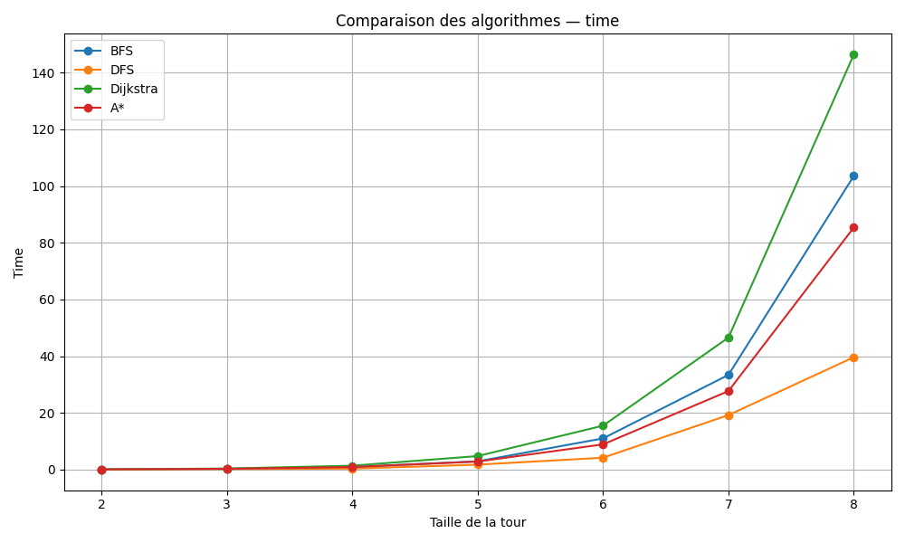{ width=80% }

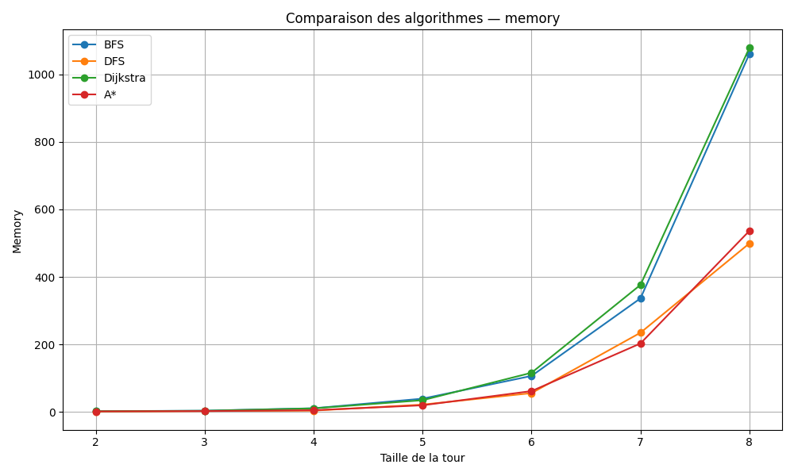{ width=80% }

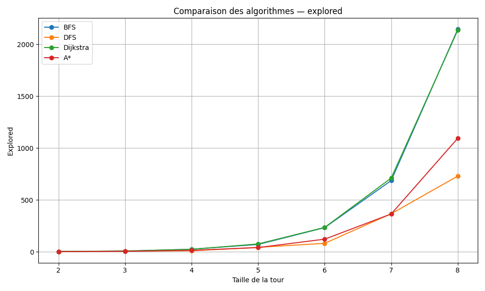{ width=80% }

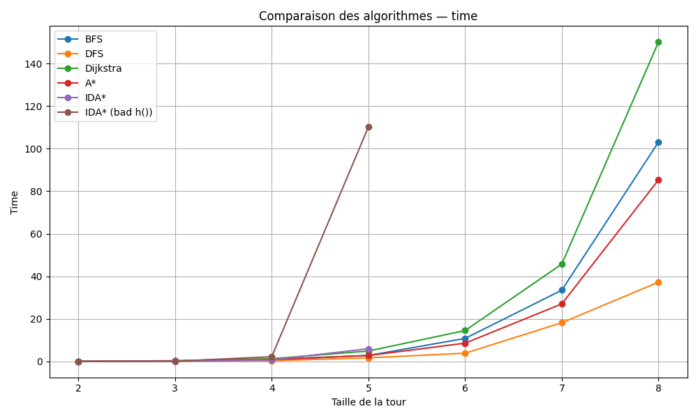{ width=80% }

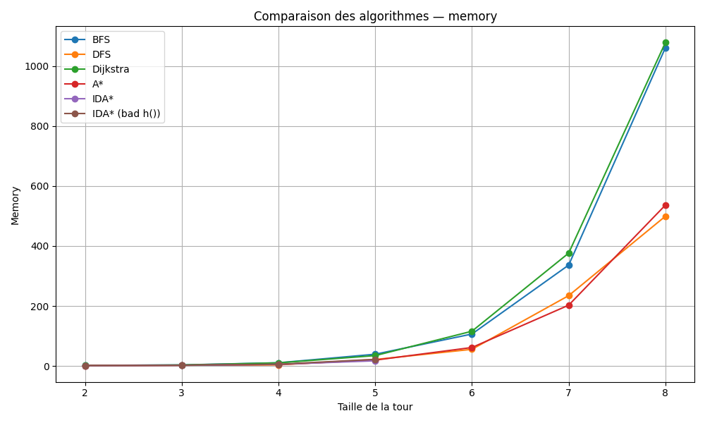{ width=80% }

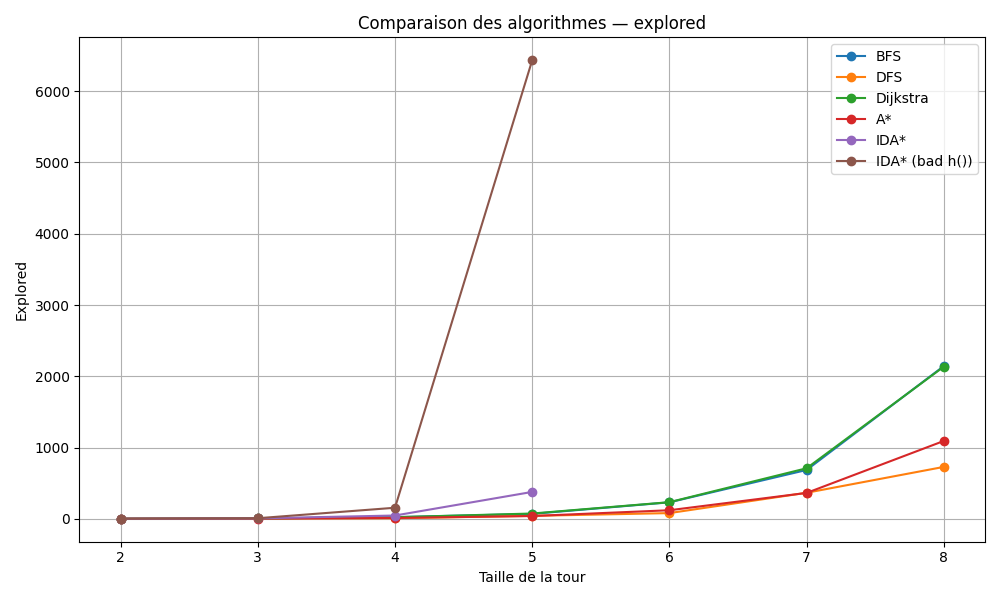{ width=80% }

### 3.3.2 Analyse des stratégies non informées

Contrairement au problème de la grille, l'efficacité des algorithmes non informés varie considérablement sur la structure récursive des Tours de Hanoï.

#### **DFS (Depth-First Search)**

- **Comportement :** Le DFS est le grand gagnant de ce benchmark. Contrairement à une recherche spatiale où il risque de s'égarer, ici la structure du problème favorise une exploration en profondeur qui atteint rapidement une solution.

- **Performance :** Il est l'algorithme **le plus rapide** (seulement **39.6 ms** pour $N=8$) et a exploré le moins de noeuds parmi les méthodes non informées (**730 noeuds** contre plus de 2 000 pour les autres).

- **Mémoire :** Il est également très économe (**499 Mo** pour $N=8$), consommant deux fois moins que le BFS.

#### **BFS (Breadth-First Search)**

- **Exploration :** Le BFS explore systématiquement les configurations couche par couche. Pour $N=8$, il explore **2 145 noeuds**, soit trois fois plus que le DFS.

- **Performance :** Il reste performant (**103.6 ms** pour $N=8$), mais souffre d'une consommation mémoire élevée (**1 061 Mo**) due au stockage de la frontière (la file d'attente) qui grandit exponentiellement.

#### **Dijkstra**

- **Surcharge inutile :** Le coût de chaque mouvement étant uniforme (+1), Dijkstra se comporte comme un BFS mais avec une surcharge algorithmique (gestion de la `priority_queue`).

- **Performance :** Il est le plus lent des algorithmes classiques (**146.4 ms** pour $N=8$). Il explore un nombre de noeuds quasi identique au BFS (2 136) mais consomme davantage de temps CPU pour gérer l'ordonnancement.

### 3.3.3 Analyse des stratégies informées (A* et IDA*)

Nous avons testé deux approches heuristiques :

1.  **Mauvaise heuristique :** $h(s) =$ Nombre de disques qui ne sont pas sur la pile finale.
2.  **Bonne heuristique :** Une fonction exponentielle plus discriminante.

Cette "bonne" heuristique reflète le coût minimal pour déplacer un disque $k$, réduit si un préfixe correct est déjà en place. Elle se formule ainsi :

$$h(s) = \sum_{k \in \text{Disques Incorrects}} 2^{\max(0, k - 1 - P)}$$

*Où $P$ est la longueur du préfixe correct (disques 1, 2, ... P bien placés) sur la pile finale.*

#### A* (A-Star)

- **Efficacité de l'heuristique :** Contrairement aux algorithmes non informés, A* tire parti de l'heuristique pour réduire l'espace de recherche. Il explore **1 094 noeuds** pour $N=8$, ce qui est deux fois mieux que le BFS (2 145), mais reste supérieur au DFS (730) qui a "chanceusement" trouvé le chemin direct.

- **Performance :** Grâce à cet élagage, A* (**85.4 ms**) est plus rapide que le BFS (**103.6 ms**) et consomme deux fois moins de mémoire (**536 Mo** contre 1 061 Mo). C'est un excellent compromis, bien que battu par la rapidité brute du DFS sur ce problème spécifique.

#### IDA* (Iterative Deepening A*)

IDA* tente de combiner la faible empreinte mémoire du DFS avec l'information de l'heuristique.

- **Avec une mauvaise heuristique :** Les résultats sont catastrophiques. Pour $N=5$, le temps explose à **112 ms** (contre 2.9 ms pour BFS) et le nombre de noeuds s'envole (**6 434 noeuds**). Sans mémoire des noeuds visités (`visited set`) et avec une heuristique faible, l'algorithme ré-explore sans cesse les mêmes états cycliques.

- **Avec une bonne heuristique :** Sur les petites instances ($N \le 5$), il est très économe en mémoire (**17.38 Mo** pour $N=5$). Cependant, il échoue sur les grandes instances (**Timeout pour $N=6, 7, 8$**).

### 3.3.4 Synthèse comparative (Hanoï)

Le tableau ci-dessous détaille les performances pour l'ensemble des tailles testées.

| Taille (N) | Algorithme | Temps Moyen (ms) | Mémoire Moyenne (Mo) | Noeuds Explorés |
| :---: | :--- | :--- | :--- | :--- |
| **2** | DFS | 0.040 | 0.97 | **3** |
| | BFS | 0.065 | 1.99 | **3** |
| | Dijkstra | 0.084 | 1.83 | **3** |
| | A* | 0.076 | 1.43 | **3** |
| | IDA* | 0.039 | **0.85** | **3** |
| | IDA* (bad h) | **0.035** | 1.13 | **3** |
| **3** | DFS | 0.224 | 2.57 | 9 |
| | BFS | 0.250 | 3.60 | 9 |
| | Dijkstra | 0.399 | 3.30 | **8** |
| | A* | 0.293 | 2.51 | **8** |
| | IDA* | **0.128** | **2.32** | **8** |
| | IDA* (bad h) | 0.147 | 2.59 | 10 |
| **4** | DFS | **0.362** | **3.84** | **15** |
| | BFS | 0.931 | 10.75 | 27 |
| | Dijkstra | 1.385 | 10.50 | 24 |
| | A* | 0.904 | 4.95 | 22 |
| | IDA* | 0.768 | 5.57 | 48 |
| | IDA* (bad h) | 2.258 | 5.96 | 157 |
| **5** | DFS | **1.753** | 21.63 | **57** |
| | BFS | 2.923 | 39.26 | 81 |
| | Dijkstra | 4.778 | 34.66 | 76 |
| | A* | 2.840 | 19.64 | 63 |
| | IDA* | 6.097 | **17.38** | 379 |
| | IDA* (bad h) | 112.800 | 22.20 | 6 434 |
| **6** | DFS | **4.203** | **55.63** | **123** |
| | BFS | 11.015 | 106.62 | 243 |
| | Dijkstra | 15.501 | 115.95 | 235 |
| | A* | 8.903 | 61.69 | 185 |
| | IDA* | *Timeout* | - | - |
| **7** | DFS | **19.233** | 234.59 | **489** |
| | BFS | 33.408 | 336.42 | 729 |
| | Dijkstra | 46.568 | 376.33 | 711 |
| | A* | 27.701 | **202.79** | 550 |
| | IDA* | *Timeout* | - | - |
| **8** | DFS | **39.643** | **499.31** | **1 095** |
| | BFS | 103.575 | 1 060.95 | 2 187 |
| | Dijkstra | 146.395 | 1 078.84 | 2 136 |
| | A* | 85.398 | 536.49 | 1 644 |
| | IDA* | *Timeout* | - | - |

L'analyse des Tours de Hanoï offre un contraste frappant avec la recherche sur grille et met en évidence trois points clés :

1.  **La suprématie du DFS :** Grâce à la structure récursive du problème, le DFS est imbattable (**39 ms** pour $N=8$). Il prouve qu'une stratégie simple, parfaitement alignée avec la topologie du graphe, peut surclasser des méthodes plus complexes.

2.  **Le compromis de A\* :** Bien que l'heuristique ait réduit l'espace de recherche par deux face au BFS (1 094 noeuds contre 2 145), le surcoût de calcul rend A\* deux fois plus lent que le DFS (**85 ms**). L'élagage n'a pas suffi à rentabiliser l'intelligence ajoutée.

3.  **L'échec d'IDA\* :** L'absence de mémorisation (*visited set*) est fatale dans un espace exponentiel. L'algorithme s'effondre en ré-explorant continuellement les mêmes sous-arbres, menant à des timeouts systématiques sur les grandes instances.

En somme, ce benchmark rappelle que le choix de l'algorithme dépend avant tout de la **topologie du problème** : ici, la force brute dirigée (DFS) l'emporte sur l'heuristique.

## 3.4 Missionnaires et Cannibales

Le problème des missionnaires et des cannibales consiste à transférer x missionnaires et x cannibales d’une rive à l’autre à l’aide d’un bateau de capacité limitée (ici à 2), tout en respectant une contrainte de sécurité : sur chaque rive, le nombre de cannibales ne doit jamais dépasser celui des missionnaires, et un missionnaire doit accompagner un cannibale sur le bâteau.
L’espace d’états forme un petit graphe fortement contraint, sans croissance exponentielle, mais avec une structure riche : états dangereux, actions restreintes, transitions asymétriques et cycliques.
Dans cette implémentation, une fonction permet de savoir en avance si le chemin est valide et de générer ainsi les successeurs possibles. Implémentaton : [Subangkar gitlab](https://gitlab.com/Subangkar-cse-buet/Missionaries-and-Cannibals-Problem-Python)

**Configuration des tests :**

- **Taille du problème :** Instances classiques (3 missionnaires / 3 cannibales) et variantes (4,5,7,10,15,20).
- **Algorithmes testés :** BFS, DFS, Dijkstra, A*, IDA*.

### 3.4.1 Visualisation des performances

Les graphiques ci-dessous montrent l'évolution des métriques.

*Note : IDA\* explosant sur ce problème, deux graphiques pour chaque représentations ont été générés : l'un avec, et l'autre sans IDA\**

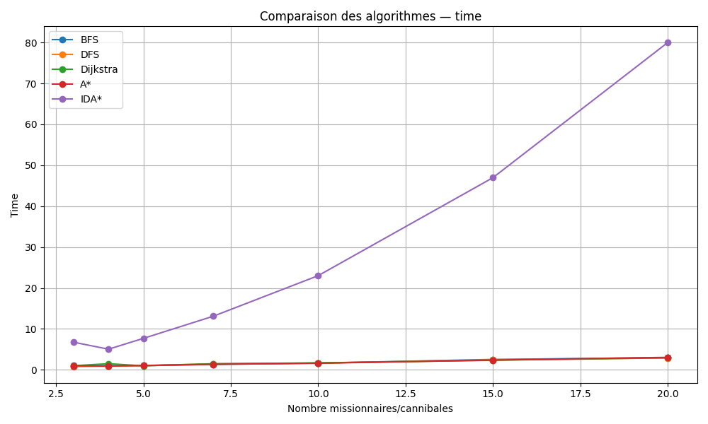{ width=80% }

{ width=80% }

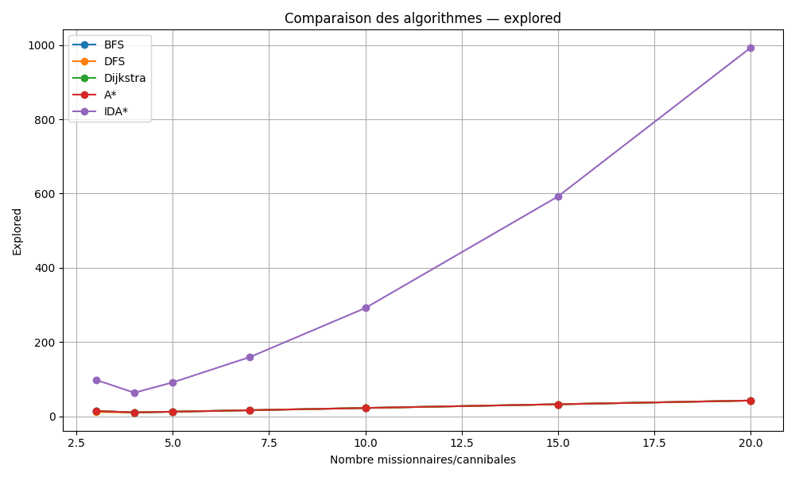{ width=80% }

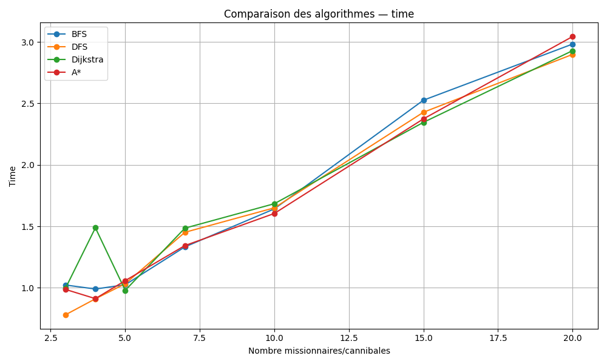{ width=80% }

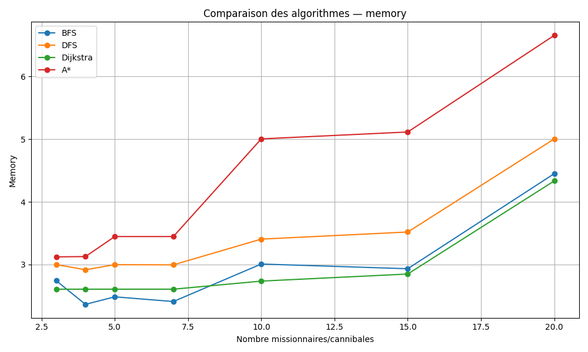{ width=80% }

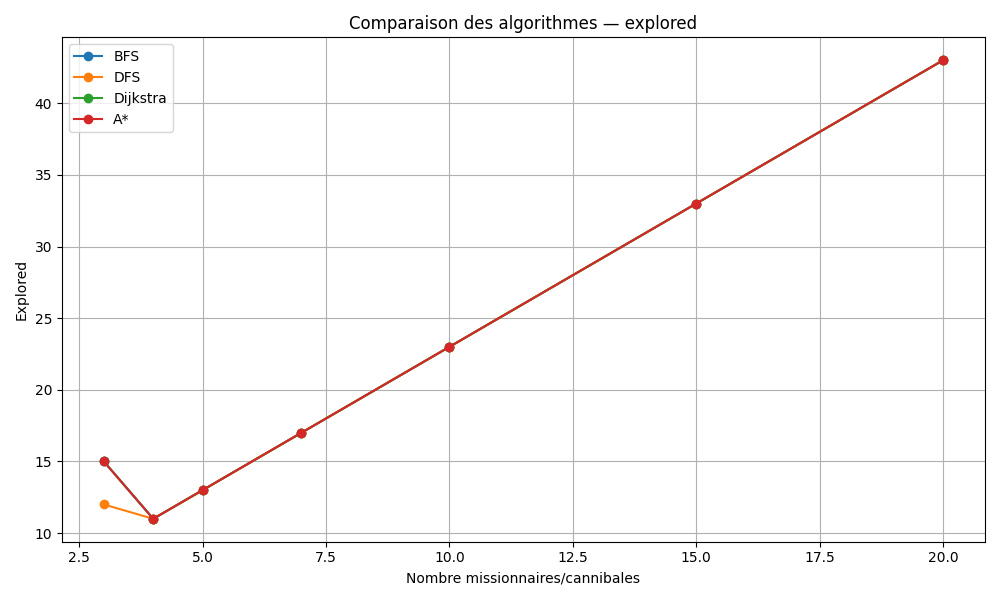{ width=80% }

### 3.4.2 Analyse des stratégies non informées

Les algorithmes non informés se comportent très différemment de ce que l’on observe sur les Tours de Hanoï : ici, le graphe étant de taille faible (notamment avec la définition en avance des successeus) mais très contraint, les stratégies non informées dominent.

#### **DFS (Depth-First Search)**

- **Comportement :** Le DFS a tendance à s'enfoncer rapidement dans des impasses. Sans mémoire des noeuds visités, il multiplierait les réexplorations. Comme il garde en mémoire les noeuds visités, et connait les successeurs possibls, il est performant. Point qui le démarque des autres : il explore moins de noeuds que tous les autres aglorithme pour une taille 3/3 (**12 noeuds** contre 15 pour tous les autres) et est nettement plus rapide.

- **Performance :** Pour toutes les instances, il explore tous les chemins non interdits. Comme le graphe est de taille très faible, il est très performant, comparable aux autres algorithmes non informés. (**3ms** et **43 noeuds** explorés pour une taille de 20/20)

- **Mémoire :** Très faible (pile uniquement), **5Mo** pour 20 missionnaires/cannibales.

#### **BFS (Breadth-First Search)**

- **Exploration :** Le BFS explore uniformément tout l'espace d’états valides. Comme celui-ci est limité, le BFS trouve systématiquement la solution optimale, même performance que DFS.

- **Performance :**: Similaire au DFS : Il prend juste un peu moins de mémoire que le DFS (**4.5MO** à peine) 

#### **Dijkstra**

- **Surcharge inutile :** Le coût de chaque mouvement étant uniforme (+1), Dijkstra se comporte comme un BFS mais avec une surcharge algorithmique (gestion de la `priority_queue`).

- **Performance :** Performances similaires aux deux autres algorithmes non informés. Cependant, malgré le coût uniforme et donc une "surcharge" algorithmique avec la gestion de la queue, il s'agit de l'algorithme avec, pour les plus grandes tailles, le moins de mémoire utilisée (similaire à BFS). En effet, il ne ré-enfile pas les nœuds si un chemin moins coûteux existe déjà.

### 3.4.3 Analyse des stratégies informées (A* et IDA*)

Nous avons décidé d'utiliser une bonne heuristique ((remaining + cap - 1) // cap) donnant le nombre minimal de traversées nécessaires pour déplacer tout le monde, sans prendre en compte les contraintes. Même avec une heuristique plus informée, ça ne change pas les résultats.

#### A* (A-Star)

- **Efficacité de l'heuristique :** Ici, l'heuristique est inefficace. 

- **Performance :** Pour l'exploration et le temps, A* est exactement au même niveau que bfs et dijkstra. Cependant, en raison de sa gestion de l'heuristique, il prend plus de mémoire que les algorithmes non informés (plus de **6.6Mo**)  

#### IDA* (Iterative Deepening A*)

- **Performance :** Médiocre en tout point. En effet, il explose partout, que ce soit en exploration, en mémoire ou en temps. La raison à cela : IDA* utilise une détection de cycle locale uniquement, et ne garde pas en mémoire les chemins vistés (l'objectif de l'algorithme étant de libérer de la mémoire,  ne gardant pas les chemins précédents, en faisant une recherche en profondeur itérative avec un seuil limit.). Il réexplore donc les mêmes états, ce qui explique cet écart si important : un peu moins de **992 noeuds** explorés, presque **40Mo** de mémoire, et **80Ms** de temps.

- **Conclusion :** Les algorithmes de recherches informées sont beaucoup moins efficaces, en raison du graph de très petite taille, très cyclique, et très contraignant. 

## **3.4.4 Synthèse comparative (Missionnaires et Cannibales)**

| Taille (N/N) | Algorithme | Temps Moyen (ms) | Mémoire Moyenne (Mo) | Noeuds Explorés |
| :---: | :--- | :--- | :--- | :--- |
| **3** | DFS | 0.78 | 3.00 | **12** |
| | BFS | 1.02 | 2.74 | 15 |
| | Dijkstra | 0.99 | 2.60 | 15 |
| | A* | 0.99 | 3.12 | 15 |
| | IDA* | **6.75** | **11.37** | **99** |
| **4** | DFS | 0.91 | 2.92 | 11 |
| | BFS | 0.99 | 2.36 | 11 |
| | Dijkstra | 1.49 | 2.61 | 11 |
| | A* | 0.91 | 3.13 | 11 |
| | IDA* | **5.04** | **7.82** | **64** |
| **5** | DFS | 1.03 | 2.99 | 13 |
| | BFS | 1.02 | 2.49 | 13 |
| | Dijkstra | 0.98 | 2.61 | 13 |
| | A* | 1.06 | 3.45 | 13 |
| | IDA* | **7.69** | **9.67** | **92** |
| **7** | DFS | *1.45 | 2.99 | 17 |
| | BFS | 1.33 | 2.41 | 17 |
| | Dijkstra | 1.49 | 2.61 | 17 |
| | A* | 1.34 | 3.45 | 17 |
| | IDA* | **13.10** | **12.71** | **160** |
| **10** | DFS | 1.65 | 3.40 | 23 |
| | BFS | 1.64 | 3.01 | 23 |
| | Dijkstra | 1.68 | 2.74 | 23 |
| | A* | 1.60 | 5.01 | 23 |
| | IDA* | **23.01** | **17.32** | **292** |
| **15** | DFS | 2.43 | 3.52 | 33 |
| | BFS | 2.53 | 2.93 | 33 |
| | Dijkstra | 2.34 | 2.85 | 33 |
| | A* | 2.37 | 5.12 | 33 |
| | IDA* | **46.97** | **26.51** | **592** |
| **20** | DFS | 2.90 | 5.00 | 43 |
| | BFS | 2.98 | 4.45 | 43 |
| | Dijkstra | 2.93 | 4.33 | 43 |
| | A* | 3.044 | 6.66 | 43 |
| | IDA* | **79.99** | **39.30** | **992** |

## **Conclusion**

L’étude du problème des missionnaires et cannibales met en évidence un problème majeur : **IDA*** s’effondre, due à l’absence d'historique, entraîne des réexplorations répétées, rendant l’algorithme inefficace.

En résumé, ce benchmark montre que les algorithmes non informés sont beaucoup plus performants que les algorithmes informés sur ce problème, qui sont pénalisés par les contraintes logiques et la présence de cycles.

# 4. Discussion et Limites

Au terme de ces expérimentations, nous pouvons dégager des tendances claires sur l'adéquation entre le type de problème et l'algorithme de résolution.

## 4.1 Synthèse des tendances

L'analyse comparative met en évidence trois profils de performance distincts :

- **L'efficacité des algorithmes non informés (BFS/DFS) :**
    - Sur des graphes à coût uniforme, **BFS** reste la référence pour garantir l'optimalité. Cependant, sa consommation mémoire (linéaire par rapport au facteur de branchement) devient critique sur les instances larges (ex: Grille 320x320).
    - **DFS** s'est révélé être le champion inattendu sur le problème des Tours de Hanoï. Grâce à une gestion mémoire minimale (pile) et un graphe d'états fini sans "pièges" infinis, il surclasse les méthodes plus complexes.
    - En général, les **algorithmes non informés** sont une excellente solution pour les problèmes cycliques de petit graph (à condition d'avoir un historique)

- **La lourdeur de Dijkstra sur les coûts uniformes :**
    - Bien que théoriquement parfait pour les graphes pondérés, **Dijkstra** est systématiquement sous-performant sur nos problèmes à coûts unitaires (poids = 1). La gestion de la file de priorité (`PriorityQueue`) engendre un surcoût temporel et une consommation mémoire excessive (jusqu'à 15 Go sur grille) sans apporter de gain topologique par rapport à un simple BFS.

- **La puissance conditionnelle des heuristiques (A\* / IDA\*) :**
    - L'efficacité d'un algorithme informé dépend entièrement de la qualité de son heuristique.
    - **Sur les Grilles :** L'heuristique de Manhattan est très discriminante. Elle permet à **A\*** et surtout **IDA\*** d'ignorer des pans entiers de la grille, offrant des performances spectaculaires.
    - **Sur Hanoï :** L'heuristique utilisée s'est avérée inefficace. Dans ce cas, le surcoût de calcul de l'heuristique rend A\* moins performant qu'une recherche non informée.

## 4.2 Limites observées

Nos implémentations ont rencontré deux types de barrières critiques :

1.  **Explosion Mémoire ("Out of Memory") :**
    - C'est la limite principale pour **Dijkstra** et **A\*** sur les grandes grilles ($N=320$). Stocker des centaines de milliers de noeuds avec leurs métadonnées (coûts g/h, parents) sature rapidement la RAM (16 Go dans notre environnement de test).

2.  **Explosion Temporelle (Timeout) :**
    - C'est la limite rencontrée par **IDA\*** sur les Tours de Hanoï. L'absence de mémorisation des états visités (`visited set`), couplée à un graphe contenant de multiples chemins vers les mêmes états (cycles/transpositions), entraîne un nombre gigantesque de ré-explorations.

# 5. Conclusion

Ce mini-projet de benchmarking nous a permis de confronter la théorie algorithmique à la réalité de l'exécution machine. L'enseignement principal est qu'il n'existe pas d'algorithme universellement supérieur : le choix de la méthode doit être dicté par la **topologie du problème** et les **contraintes ressources**.

- Pour la **navigation spatiale** (Grilles), les approches itératives guidées par heuristique (**IDA\***) sont imbattables.

- Pour les **problèmes combinatoires** complexes (Hanoï), la simplicité du **DFS** prévaut, tant que l'on ne dispose pas d'une heuristique très performante.

- Pour les **problèmes cycliques et contraignants** avec un petit graph, les **algorithmes non informés** se distinguent. **IDA\***, quant à lui, est à proscrire.

- Pour les graphes généraux non pondérés, **BFS** reste le compromis sécurité/efficacité standard.