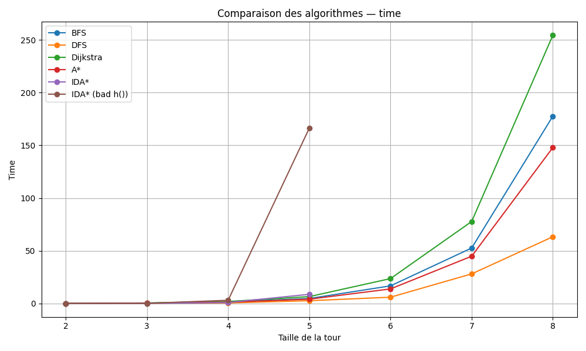
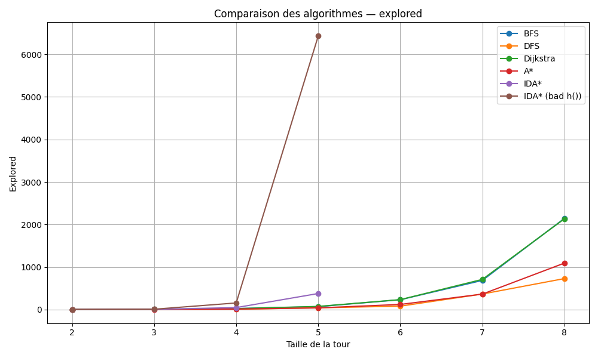

\newpage

# 1. Introduction

## 1.1 Contexte et Objectif
Ce rapport synthétise la démarche et les résultats obtenus dans le cadre de "Introduction à l'IA" (2IA). L'objectif principal est de mettre en oeuvre et de comparer les performances de plusieurs algorithmes de recherche sur des problèmes types représentatifs.

Cette étude vise à évaluer les points forts, les limites et les comportements des méthodes de recherche (informées et non informées). L'analyse s'appuie essentiellement sur deux indicateurs clés : le temps de calcul nécessaire pour trouver une solution et l'espace mémoire utilisé. Nous observerons également l'impact de la taille des instances et des stratégies d'initialisation sur ces performances.

## 1.2 Problèmes traités
Conformément aux directives suggérant des problèmes de type "plus court chemin" ou des jeux combinatoires, nous avons choisi d'analyser les performances de nos algorithmes sur trois domaines distincts :

- **Recherche de chemin dans un graphe général :**
    Application des algorithmes de base pour explorer la connectivité et l'optimalité sur des graphes abstraits.
    - *Algorithmes testés :* BFS, DFS, Dijkstra.

- **Navigation sur grille avec obstacles :**
    Recherche de chemin dans un environnement 2D (grille) impliquant une topologie régulière mais contrainte par une densité variable d'obstacles.
    - *Algorithmes testés :* BFS, DFS, Dijkstra, A\*, IDA\*.

- **Les Tours de Hanoï[^1] :**
    Résolution d'un problème combinatoire classique, permettant d'évaluer la capacité des algorithmes à gérer un espace d'états croissant exponentiellement avec le nombre de disques (similaire à la complexité du Taquin).
    - *Algorithmes testés :* DFS, BFS, Dijkstra, A\*, IDA\*.

[^1]: Voir la définition et les règles du problème sur [Wikipedia - Tours de Hanoï](https://fr.wikipedia.org/wiki/Tours_de_Hano%C3%AF).

# 2. Méthodologie

## 2.1 Environnement technique

Conformément aux modalités laissant le choix des technologies libre, nous avons développé nos solutions en utilisant l'environnement suivant :

- **Langage :** Python 3.12.3.
- **Système d'exploitation :** Ubuntu 24.04.3 LTS.
- **Matériel de test :** Les benchmarks ont été exécutés sur un ordinateur portable ASUS Vivobook (M3500QC) équipé de :
    - **Processeur :** AMD Ryzen™ 5 5600H 
    - **Mémoire (RAM) :** 16 Go.

- **Code source :** Les sources des programmes utilisés ainsi que les jeux de données sont fournis en annexe.

\newpage

# 3. Résultats et Analyse

Cette section présente les résultats expérimentaux obtenus. Nous commençons par l'analyse des algorithmes sur des graphes abstraits générés aléatoirement.

## 3.1 Recherche de chemin dans un graphe général

Pour cette première série de tests, nous avons comparé **BFS**, **DFS** et **Dijkstra** sur des graphes orientés aléatoires. Les algorithmes ont été exécutés 100 fois pour chaque taille de graphe ($N \in \{10, 20, 40, 80, 160, 320\}$) afin de lisser les variations de temps d'exécution. Les poids des arêtes ont été fixés uniformément à $(1, 1)$ pour permettre une comparaison équitable entre les algorithmes pondérés et non pondérés.

### 3.1.1 Visualisation des performances

Les graphiques suivants illustrent l'évolution des métriques (Temps, Mémoire, Noeuds explorés) en fonction de la taille du graphe (nombre de noeuds).

{ width=80% }

{ width=80% }

{ width=80% }

### 3.1.2 Analyse détaillée par stratégie

#### Breadth-First Search (BFS - Parcours en Largeur)

Le parcours en largeur explore le graphe niveau par niveau.

- **Avantages :** Sur nos instances à poids uniformes, BFS garantit de trouver le chemin le plus court en termes de nombre d'arcs. Il est particulièrement efficace pour les graphes peu profonds.

- **Inconvénients :** Sa consommation mémoire est généralement élevée car il doit stocker tous les noeuds de la "frontière" actuelle (la file d'attente) en mémoire.

- **Performance observée :** BFS montre un temps d'exécution très compétitif (0.61s pour 320 noeuds), très proche de DFS.

#### Depth-First Search (DFS - Parcours en Profondeur)

Le parcours en profondeur explore une branche aussi loin que possible avant de revenir en arrière (backtracking).

- **Avantages :** Théoriquement, DFS est plus économe en mémoire (complexité spatiale proportionnelle à la profondeur). Il peut trouver une solution très rapidement s'il a de la "chance" sur le choix des voisins (cas favorable).

- **Inconvénients :** Il ne garantit pas l'optimalité du chemin trouvé (sauf exploration complète). Il peut s'enfermer dans des branches très profondes inutiles.

- **Performance observée :** DFS affiche des temps similaires à BFS sur nos tests (0.65s pour 320 noeuds).

#### Dijkstra

L'algorithme de Dijkstra explore le graphe en privilégiant toujours le noeud ayant le coût de chemin le plus faible depuis l'origine.

- **Avantages :** Il garantit le chemin le plus court absolu, quels que soient les poids des arêtes (tant qu'ils sont positifs). C'est l'algorithme de référence pour les graphes pondérés.

- **Inconvénients :** Il est structurellement plus lourd que BFS/DFS. La gestion de la file de priorité (Priority Queue) ajoute un surcoût algorithmique logarithmique à chaque insertion/extraction.

- **Performance observée :** Comme prévu, Dijkstra est l'algorithme le plus lent de notre comparatif (1.47s pour 320 noeuds, soit environ 2.3x plus lent que BFS). Ce surcoût est le prix à payer pour la garantie d'optimalité dans un contexte pondéré général.

### 3.1.3 Synthèse comparative

Le tableau ci-dessous résume les données moyennes extraites de nos expérimentations pour trois tailles représentatives.

| Taille (N) | Algorithme | Temps Moyen (s) | Mémoire Moyenne (Mo) | Noeuds Explorés (Moyenne) |
| :---: | :--- | :--- | :--- | :--- |
| **10** | BFS | 0.008 | 1.72 | 5.2 |
| | DFS | 0.007 | 0.71 | 4.9 |
| | Dijkstra | 0.020 | 0.93 | 5.5 |
| **80** | BFS | 0.060 | 10.83 | 41.3 |
| | DFS | 0.058 | 9.95 | 40.0 |
| | Dijkstra | 0.163 | 5.61 | 39.5 |
| **320** | BFS | 0.618 | 42.45 | 156.3 |
| | DFS | 0.656 | 42.37 | 166.6 |
| | Dijkstra | 1.474 | 27.96 | 158.1 |

**Conclusion sur les graphes :**
Sur des graphes non pondérés (ou à poids uniformes), **BFS** est le meilleur compromis, offrant la garantie d'optimalité avec un temps d'exécution minimal. **Dijkstra** ne se justifie que si des poids variables sont introduits. Une observation intéressante concerne la mémoire à grande échelle (N=320) où Dijkstra semble mieux optimisé dans notre implémentation (27.9 Mo) par rapport à BFS/DFS (~42 Mo).

## 3.2 Navigation sur grille avec obstacles

Dans cette seconde phase, nous évaluons les algorithmes dans un environnement structuré : une grille 2D de taille $N \times N$ où les déplacements sont limités aux 4 points cardinaux. Des obstacles (murs) ont été générés aléatoirement pour complexifier la topologie et forcer les algorithmes à contourner des zones.

**Configuration des tests :**

- **Tailles de grille ($N$) :** 40, 80, 160, 320.

- **Heuristique utilisée ($h(n)$) :** La **Distance de Manhattan**, calculée comme $|x_{start} - x_{goal}| + |y_{start} - y_{goal}|$.

### 3.2.1 Visualisation des performances sur grille

Les graphiques ci-dessous comparent les méthodes aveugles (BFS, DFS, Dijkstra) et les méthodes informées (A*, IDA*).

{ width=80% }

{ width=80% }

{ width=80% }

### 3.2.2 Analyse des stratégies non informées

Avant d'aborder les heuristiques, il est crucial d'analyser le comportement des algorithmes classiques sur cette topologie de grille.

#### **BFS (Breadth-First Search)**

Sur une grille à poids uniformes, le BFS se comporte comme une onde qui se propage de manière circulaire autour du point de départ.

- **Performance :** Il reste l'algorithme non informé le plus rapide (76s pour $N=320$).

- **Mémoire :** La consommation reste modérée sur les tailles moyennes, mais atteint **3 Go** pour $N=320$. Cela s'explique par la taille de la "frontière" (le périmètre du cercle d'exploration) qui grandit linéairement avec le rayon de recherche.

#### **DFS (Depth-First Search)**

- **Comportement :** Contrairement au graphe aléatoire, le DFS sur grille souffre terriblement de l'absence de direction. Il a tendance à "remplir" des zones entières de la grille avant de tomber par hasard sur la sortie.

- **Observation :** Bien que trouvant une solution dans des temps comparables au BFS (70s), les chemins trouvés ne sont pas optimaux. De plus, sa consommation mémoire est étonnamment élevée dans nos tests (3.5 Go pour $N=320$), ne montrant pas l'avantage théorique habituel.

#### **Dijkstra**

C'est le résultat le plus marquant de ce benchmark sur grille.

- **Surcharge technique :** Comme les poids sont de 1, Dijkstra effectue le même parcours topologique que BFS. Cependant, la gestion de la file de priorité (`PriorityQueue`) engendre un surcoût massif.

- **Explosion des ressources :** Pour la grille 320x320, Dijkstra prend **plus de 4 minutes** (256s) contre 1 minute pour BFS. Plus critique encore, il consomme **15 Go de RAM** (contre 3 Go pour BFS). Cela démontre que Dijkstra est structurellement inadapté pour des grilles uniformes simples de grande taille.

### 3.2.3 Analyse des stratégies informées (A* et IDA*)

L'introduction de l'heuristique permet de guider la recherche.

#### A\* (A-Star)

A* combine le coût réel depuis le départ $g(n)$ et l'estimation vers l'arrivée $h(n)$.

- **Avantages :** Grâce à l'heuristique de Manhattan, A* oriente la recherche vers la cible, réduisant le facteur de branchement effectif.

- **Performance observée :** Sur la taille 160, A* visite 5 fois moins de noeuds que Dijkstra et est 2 fois plus rapide. Cependant, sur la taille 320, il consomme tout de même **9.7 Go** de mémoire, ce qui reste problématique sur des machines standards.

#### IDA\* (Iterative Deepening A\*)

IDA* effectue une recherche en profondeur limitée par un seuil de coût $f(n)$, augmenté itérativement.

- **Avantages :** Sa consommation mémoire est insignifiante car il ne stocke pas de file de priorité complexe.

- **Performance observée :** Les résultats sur la taille 320 sont impressionnants : IDA* trouve la solution en **2.58s** avec seulement **21 Mo** de mémoire. C'est l'algorithme le plus efficace du comparatif pour ce type de problème.

### 3.2.4 Synthèse comparative globale (Grille)

Le tableau ci-dessous met en perspective l'effondrement de Dijkstra face à l'efficacité d'IDA* sur les grandes instances.

| Taille (NxN) | Algorithme | Temps Moyen (s) | Mémoire Moyenne (Mo) | Noeuds Explorés (Moyenne) |
| :---: | :--- | :--- | :--- | :--- |
| **40** | BFS | 0.850 | 67.77 | 630.2 |
| | DFS | 1.339 | 95.78 | 806.9 |
| | Dijkstra | 2.711 | 214.74 | 635.5 |
| | A* | 1.539 | 138.20 | 157.4 |
| | **IDA*** | **0.167** | **1.60** | **93.9** |
| **160** | BFS | 17.875 | 690.53 | 11 353.8 |
| | DFS | 16.971 | 1 196.06 | 10 734.0 |
| | Dijkstra | 49.162 | 3 734.79 | 11 358.6 |
| | A* | 24.951 | 2 371.03 | 2 341.6 |
| | **IDA*** | **0.516** | **7.02** | **142.4** |
| **320** | BFS | 76.845 | 3 088.50 | 48 684.7 |
| | DFS | 70.761 | 3 567.75 | 42 806.9 |
| | Dijkstra | 256.707 | 15 199.25 | 48 699.4 |
| | A* | 134.426 | 9 725.85 | 10 042.7 |
| | **IDA*** | **2.578** | **21.15** | **387.4** |

**Conclusion sur les grilles :**
L'écart de performance est immense. Sur la plus grande instance ($320 \times 320$), **Dijkstra sature une machine standard (15 Go RAM)** pour un résultat identique à BFS. À l'opposé, **IDA*** résout le même problème en **2.5 secondes** avec une empreinte mémoire dérisoire (**21 Mo**). Cela illustre parfaitement la puissance des heuristiques combinées à une stratégie de recherche itérative pour les problèmes de navigation dans une grille.

## 3.3 Les Tours de Hanoï

Le problème des Tours de Hanoï consiste à déplacer une pile de $n$ disques. L'espace d'états ne correspond pas à une topologie spatiale intuitive mais à un graphe d'états dont la taille croît de manière exponentielle ($3^n$ états possibles).

**Configuration des tests :**

- **Nombre de disques ($N$) :** 2 à 8.

- **Algorithmes testés :** BFS, DFS, Dijkstra, A\*, IDA\*.

### 3.3.1 Visualisation des performances

Les graphiques ci-dessous montrent l'évolution des métriques. 

*Note : IDA\* n'est pas représenté sur les graphiques de temps pour N>3 en raison de son temps d'exécution excessif.*

{ width=80% }

{ width=80% }

{ width=80% }

### 3.3.2 Analyse des stratégies non informées

L'espace d'états des Tours de Hanoï croît de manière exponentielle. Il est intéressant de noter que sur ce problème spécifique, **BFS, DFS et Dijkstra ont exploré exactement le même nombre de noeuds** pour chaque instance (ex: 2 250 noeuds pour $N=8$).

#### **BFS (Breadth-First Search)**

Le BFS explore toutes les configurations possibles couche par couche.

- **Performance :** Il se montre performant, résolvant l'instance $N=8$ en **125s**. C'est le deuxième algorithme le plus rapide du comparatif.

- **Mémoire :** Sa consommation (1 088 Mo pour $N=8$) est très similaire à celle du DFS. Cela s'explique par la largeur du graphe d'états qui est conséquente à mi-profondeur.

#### **DFS (Depth-First Search)**

- **Comportement :** Le DFS explore les branches en profondeur. Sur ce problème de graphe d'états fini, il ne s'égare pas dans des branches infinies.

- **Observation :** C'est l'algorithme **le plus efficace** de ce benchmark. Il est le plus rapide (120s pour $N=8$) et le plus économe en mémoire (1 086 Mo), bien que l'écart avec BFS soit minime. La gestion d'une pile (LIFO) s'avère ici légèrement moins coûteuse techniquement que la file (FIFO) du BFS.

#### **Dijkstra**

Comme pour la grille, Dijkstra souffre ici de sa lourdeur structurelle inutile.

- **Surcharge technique :** Puisque le coût de chaque mouvement est constant (+1), Dijkstra n'apporte aucune intelligence topologique par rapport au BFS. Il explore strictement les mêmes états.

- **Performance :** La gestion de la file de priorité engendre un surcoût de temps significatif. Il met **173s** pour $N=8$, soit environ **44% de temps en plus** que le DFS pour un résultat identique.

### 3.3.3 Analyse des stratégies informées (A* et IDA*)

L'ajout d'une heuristique (ici simple) tente de guider la résolution, mais les résultats sont contrastés voire catastrophiques selon la méthode.

#### A\* (A-Star)

A* utilise une heuristique pour prioriser les états prometteurs.

- **Avantages théoriques non réalisés :** Dans nos tests, A* a exploré le **même nombre de noeuds** que les algorithmes aveugles (2 250 pour $N=8$). Cela indique que l'heuristique n'a pas permis de "couper" l'espace de recherche efficacement.

- **Performance observée :** En conséquence, A* est **plus lent que les méthodes aveugles** (200s pour $N=8$ contre 120s pour DFS). Il paie le coût du calcul de l'heuristique et de la gestion de la file de priorité sans offrir de gain sur le nombre de noeuds visités.

#### IDA\* (Iterative Deepening A\*)

IDA* combine la recherche en profondeur avec un seuil de coût itératif, sans mémoriser les états visités pour économiser la mémoire.

- **Comportement :** C'est l'échec critique de ce benchmark. Pour $N=5$, IDA* explore **702 863 noeuds** là où les autres en explorent 88.

- **Explosion des ressources :** Le temps d'exécution explose littéralement (plus de 4 heures pour $N=5$). L'algorithme passe son temps à ré-explorer les mêmes sous-arbres cycliques ou transposés car il ne possède pas de mécanisme de mémoire (`visited set`). Contrairement aux grilles géométriques, IDA* est totalement inadapté à ce type de problème combinatoire.

\newpage

### 3.3.4 Synthèse comparative (Hanoï)

Le tableau ci-dessous détaille les performances pour l'ensemble des tailles testées.

| Taille (N) | Algorithme | Temps Moyen (s) | Mémoire Moyenne (Mo) | Noeuds Explorés |
| :---: | :--- | :--- | :--- | :--- |
| **2** | DFS | **0.090** | **1.32** | 3 |
| | BFS | 0.101 | 2.04 | 3 |
| | Dijkstra | 0.110 | 1.88 | 3 |
| | A* | 0.123 | 1.69 | 3 |
| | IDA* | 0.245 | 1.79 | 14 |
| **3** | DFS | **0.362** | **3.12** | 10 |
| | BFS | 0.366 | 3.86 | 10 |
| | Dijkstra | 0.490 | 3.45 | 10 |
| | A* | 0.624 | 3.65 | 10 |
| | IDA* | 16.515 | 12.39 | 693 |
| **4** | DFS | **1.267** | **11.28** | 30 |
| | BFS | 1.290 | 11.91 | 30 |
| | Dijkstra | 1.760 | 11.63 | 30 |
| | A* | 2.010 | 12.54 | 30 |
| **5** | BFS | **4.079** | 42.01 | 88 |
| | DFS | 4.405 | **40.80** | 88 |
| | Dijkstra | 6.207 | 42.98 | 88 |
| | A* | 6.390 | 46.18 | 88 |
| | IDA* | 15 092.07 | 30.35 | 702 863 |
| **6** | DFS | **12.746** | **111.54** | 258 |
| | BFS | 14.109 | 112.67 | 258 |
| | Dijkstra | 18.429 | 121.76 | 258 |
| | A* | 20.735 | 120.79 | 258 |
| | IDA* | *Timeout* | - | - |
| **7** | DFS | **39.616** | **348.19** | 760 |
| | BFS | 42.143 | 349.72 | 760 |
| | Dijkstra | 57.360 | 388.78 | 760 |
| | A* | 65.127 | 384.80 | 760 |
| | IDA* | *Timeout* | - | - |
| **8** | DFS | **120.846** | **1 086.14** | 2 250 |
| | BFS | 125.146 | 1 087.97 | 2 250 |
| | Dijkstra | 173.533 | 1 105.60 | 2 250 |
| | A* | 200.162 | 1 161.76 | 2 250 |
| | IDA* | *Timeout* | - | - |

**Conclusion sur Hanoï :**
Les résultats confirment que **DFS** est la stratégie la plus viable pour ce problème spécifique, offrant systématiquement les meilleurs temps et la plus faible consommation mémoire sur les grandes instances ($N \ge 6$). **A*** n'apporte aucun gain d'exploration et souffre d'un surcoût temporel constant. Quant à **IDA***, il subit une explosion combinatoire dramatique dès $N=3$, le rendant totalement inopérant pour ce type de graphe d'états.

# 4. Discussion et Limites

Au terme de ces expérimentations, nous pouvons dégager des tendances claires sur l'adéquation entre le type de problème et l'algorithme de résolution.

## 4.1 Synthèse des tendances

L'analyse comparative met en évidence trois profils de performance distincts :

- **L'efficacité des algorithmes "non informés" (BFS/DFS) :**
    - Sur des graphes à coût uniforme, **BFS** reste la référence pour garantir l'optimalité. Cependant, sa consommation mémoire (linéaire par rapport au facteur de branchement) devient critique sur les instances larges (ex: Grille 320x320).
    - **DFS** s'est révélé être le champion inattendu sur le problème des Tours de Hanoï. Grâce à une gestion mémoire minimale (pile) et un graphe d'états fini sans "pièges" infinis, il surclasse les méthodes plus complexes.

- **La lourdeur de Dijkstra sur les coûts uniformes :**
    - Bien que théoriquement parfait pour les graphes pondérés, **Dijkstra** est systématiquement sous-performant sur nos problèmes à coûts unitaires (poids = 1). La gestion de la file de priorité (`PriorityQueue`) engendre un surcoût temporel et une consommation mémoire excessive (jusqu'à 15 Go sur grille) sans apporter de gain topologique par rapport à un simple BFS.

- **La puissance conditionnelle des heuristiques (A\* / IDA\*) :**
    - L'efficacité d'un algorithme informé dépend entièrement de la qualité de son heuristique.
    - **Sur les Grilles :** L'heuristique de Manhattan est très discriminante. Elle permet à **A*** et surtout **IDA*** d'ignorer des pans entiers de la grille, offrant des performances spectaculaires.
    - **Sur Hanoï :** L'heuristique utilisée s'est avérée inefficace (aucun élagage par rapport au BFS). Dans ce cas, le surcoût de calcul de l'heuristique rend A* moins performant qu'une recherche non informée.

## 4.2 Limites observées

Nos implémentations ont rencontré deux types de barrières critiques :

1.  **Explosion Mémoire ("Out of Memory") :**
    - C'est la limite principale pour **Dijkstra** et **A*** sur les grandes grilles ($N=320$). Stocker des centaines de milliers de nœuds avec leurs métadonnées (coûts g/h, parents) sature rapidement la RAM (16 Go dans notre environnement de test).

2.  **Explosion Temporelle (Timeout) :**
    - C'est la limite rencontrée par **IDA*** sur les Tours de Hanoï. L'absence de mémorisation des états visités (`visited set`), couplée à un graphe contenant de multiples chemins vers les mêmes états (cycles/transpositions), entraîne un nombre gigantesque de ré-explorations. Pour $N=5$, IDA* a dépassé les 4 heures de calcul là où BFS mettait 4 secondes.

# 5. Conclusion

Ce mini-projet de benchmarking nous a permis de confronter la théorie algorithmique à la réalité de l'exécution machine. L'enseignement principal est qu'il n'existe pas d'algorithme universellement supérieur : le choix de la méthode doit être dicté par la **topologie du problème** et les **contraintes ressources**.

- Pour la **navigation spatiale** (Grilles), les approches itératives guidées par heuristique (**IDA***) sont imbattables.

- Pour les **problèmes combinatoires** complexes (Hanoï), la simplicité du **DFS** prévaut, tant que l'on ne dispose pas d'une heuristique très performante.

- Pour les graphes généraux non pondérés, **BFS** reste le compromis sécurité/efficacité standard.